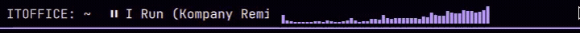

# QuattroWave

Built with Grok · Cava visualizer integration for Omarchy Quattro quickshell



One cava process feeds every monitor. Bars are real rectangles, not Unicode blocks. Theme swaps recolor them live from Omarchy's `Color` singleton (`accent`, `muted`, bar foreground).

## Requirements

- Omarchy / `omarchy-shell`
- [`cava`](https://github.com/karlstav/cava) — `omarchy pkg add cava`
- Pipewire

## Install

```bash
omarchy plugin add https://github.com/ltehacker/QuattroWave.git --enable
```

Then place it, if it did not land where you want:

```bash
omarchy bar move itdir.cava --section left --after omarchy.menu
```

Validate a local checkout:

```bash
omarchy plugin validate ~/.config/omarchy/plugins/itdir.cava
```

## Remove

```bash
omarchy plugin disable itdir.cava
omarchy plugin remove itdir.cava --yes
```

`disable` takes it off the bar. `remove` deletes the checkout. cava itself is left installed.

## Settings

Inline on the bar entry in `~/.config/omarchy/shell.json`, or:

```bash
omarchy bar set itdir.cava color gradient
omarchy bar set itdir.cava bars 24
```

| Key | Default | What it does |
|---|---|---|
| `bars` | `16` | Number of spectrum bars (`4`–`64`) |
| `color` | `accent` | `accent`, `foreground`, or `gradient` |
| `framerate` | `30` | cava frames per second (`10`–`60`) |
| `hideWhenSilent` | `false` | Hide the widget when the spectrum is quiet |

- **accent** — `Color.accent` from the active theme
- **foreground** — the bar's current text color (tracks transparent-bar contrast)
- **gradient** — each bar mixes `Color.muted` → `Color.accent` by amplitude

Right-click the widget to restart cava. Changing `bars` or `framerate` restarts cava once.

Works on top/bottom bars and on left/right bars (bars grow toward the desktop).

## License

MIT. See [LICENSE](LICENSE).
